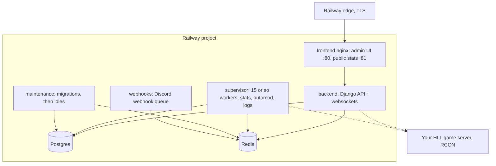

The template mirrors upstream CRCON's Docker Compose stack, one Railway
service per container:

## The services

| Service | Source | Role |
|---|---|---|
| `postgres` | `postgres:12-alpine` | All persistent data: players, bans, VIPs, stats, users |
| `redis` | `redis:alpine` | Cache, queues, and the multi-server registry |
| `maintenance` | upstream CRCON image | Runs database migrations on every deploy, then idles. It is meant to stay "running" forever |
| `backend` | this repo (thin wrapper) | The Django API and websocket server the UI talks to |
| `supervisor` | this repo (thin wrapper) | All background workers: log ingestion, stats, automod, scoreboard, VIP expiry |
| `webhooks` | upstream CRCON image | Delivers Discord webhooks from a queue |
| `frontend` | this repo (thin wrapper) | nginx serving the admin UI on port 80 and the public scoreboard on port 81, proxying API calls to the backend |

The three repo-built services are thin wrappers over the upstream
images; they exist only to adapt upstream's assumptions (shared bind
mounts, compose hostnames, one-shot DNS resolution) to how Railway
works. The CRCON code inside is untouched and pinned to a tested
upstream release.

## Startup ordering

Compose expresses ordering with `depends_on`; Railway starts everything
at once. The template handles ordering at runtime:

1. `postgres` and `redis` come up in seconds.
2. `maintenance` runs all database migrations, then sleeps.
3. The `backend` refuses to start Django until the migrations are
   complete. Until then it logs `Waiting for database migrations` every
   few seconds. This can last a while on a busy Railway build queue and
   resolves on its own.
4. `supervisor` workers retry internally until the backend is up.
5. `frontend` resolves the backend's private DNS per request, so it
   keeps working across backend redeploys.

## Networking

- Only the **frontend** is exposed publicly. Railway terminates TLS at
  its edge and forwards plain HTTP to nginx.
- Everything else talks over Railway's **private network**
  (`*.railway.internal`), including the frontend-to-backend proxy.
- The backend and supervisor make **outbound** RCON connections to your
  game server. Nothing needs to reach Railway from outside except
  players' browsers.
